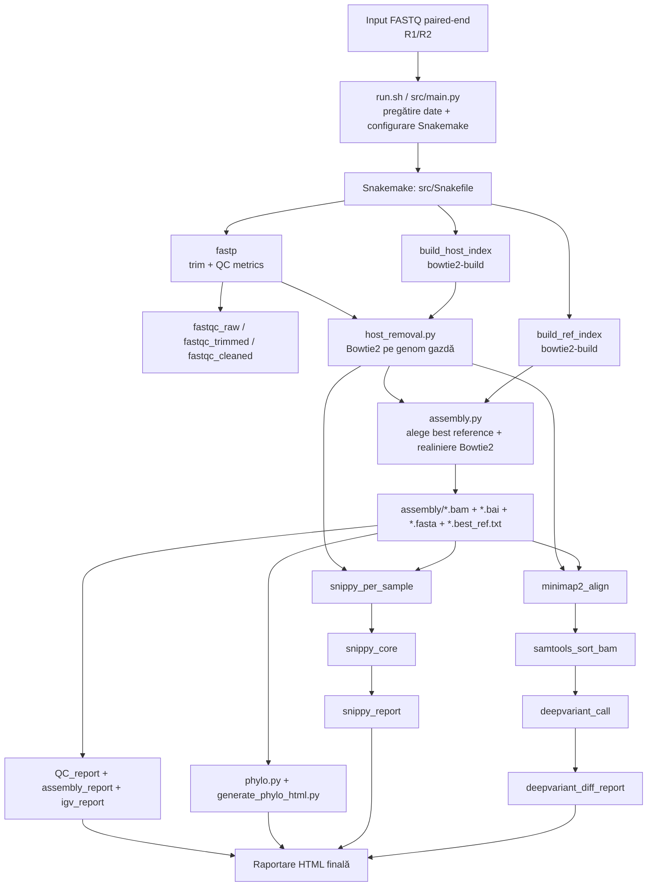

# Schema pipeline VeGAS (pentru dizertație)

## 1) Flux general



## 2) Flux pe eșantion (detaliat)

```mermaid
flowchart LR
    A[Sample R1/R2] --> B[fastp]
    B --> C[Host removal (Bowtie2)]
    C --> D[Reference selection by alignment rate]
    D --> E[Best reference]
    E --> F[Reference-guided consensus assembly]
    F --> G[BAM + BAI + consensus FASTA]

    C --> H[Snippy variant calling]
    E --> H
    H --> I[snps.vcf + consensus]

    C --> J[minimap2 -ax sr]
    E --> J
    J --> K[samtools sort/index]
    K --> L[DeepVariant]
    L --> M[deepvariant.vcf]
```

## 3) Intrări și ieșiri principale

- Intrări:
  - FASTQ paired-end (`*.fastq.gz`)
  - Genom(e) gazdă (`host/*.fasta`)
  - Genom(e) referință (`reference/*.fasta`)
- Ieșiri per sample:
  - `assembly/{sample}.bam`, `assembly/{sample}.bam.bai`, `assembly/{sample}.fasta`, `assembly/{sample}.best_ref.txt`
  - `snippy/{sample}/snps.vcf`, `snippy/{sample}/snps.consensus.fa`
  - `deepvariant/{sample}.deepvariant.vcf`
- Ieșiri agregate:
  - `QC.html`, `assembly_report.html`, `igv_report.html`
  - `phylogeny/tree.nwk`, `phylogeny_with_refs.html`
  - `snippy/core.aln`, `snippy/core.vcf`, `snippy_report.html`
  - `deepvariant/deepvariant_diff_report.html`

## 4) Frază metodologică (poți copia în capitolul de metodă)

Pipeline-ul VeGAS este orchestrat prin Snakemake și rulează procesarea paired-end în etape paralele de preprocesare, filtrare host-guided, aliniere pe referință și apel de variații (Snippy și DeepVariant), urmate de agregare în rapoarte HTML și artefacte filogenetice pentru interpretare comparativă.
